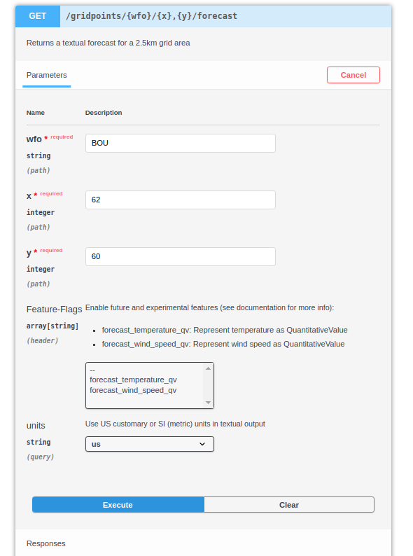

#################
API Demonstration
#################

An API, or application program interface, allow systems to interact with each other.
A Developer often creates an API to serve as a set of tools that allows other applications to interact with their applications.
Using the API, a developer can make a request to this API and receive a response.
The response will include a certain set of data in a standardized format.

This allows many programming languages to get or manipulate data.
What happens is defined by the API method. Methods are typically verbs such as POST, PUT, PATCH, or GET. 
Each request includes at least a method and endpoint. 
 
As an example, I'll make a request to RESTful national weather service (weather.gov) API using curl.
This call uses curl to execute the GET method and the ``/gridpoints/BOU/62,60/forecast`` endpoint to get forecast for tonight in Glendale, CO.

>>> curl -X GET "https://api.weather.gov/gridpoints/BOU/62,60/forecast" | grep -A 9 '"number": 1,'
  % Total    % Received % Xferd  Average Speed   Time    Time     Time  Current
                                 Dload  Upload   Total   Spent    Left  Speed
  0     0    0     0    0     0      0      0 --:--:-- --:--:-- --:--:--     0                "number": 1,
                "name": "Tonight",
                "startTime": "2021-01-14T21:00:00-07:00",
                "endTime": "2021-01-15T06:00:00-07:00",
                "isDaytime": false,
                "temperature": 19,
                "temperatureUnit": "F",
                "temperatureTrend": "rising",
                "windSpeed": "10 mph",
                "windDirection": "NW",
100 11300  100 11300    0     0   112k      0 --:--:-- --:--:-- --:--:--  112k

In the above example:

- ``curl -X`` invokes the ``GET`` method on the https://api.weather.gov resource. 
   This is a request to the National Weather Service API for information.

- The endpoint is ``/gridpoints/BOU/62,60/forecast``

  - The ``BOU`` and ``62,60`` are used to set the location for the forecast   
    
    - Format: ``/gridpoints/{wfo}/{x},{y}/``

- The response is returned in JSON format.

To keep the sample response manageable, I used ``grep`` to limit it to tonight's forecast. 

API Documentation 
=================

API documentation generally consists of the following sections.

- Getting started guide

  - Authentication set up instructions

- General usage instructions

  - Includes sample code
  
- Resource, method, and endpoint references
  
- Error code definitions

- SDK instructions 

Publishing 
===========

This documentation is delivered in many ways. The following are two of the more popular methods in use. 

Static Site Generators
----------------------

APIs are often documented on statically generated websites. 
These are websites that are made using static site generators such as Hugo or Jekyll.
I used one called Sphinx to generate this website.

Using a static site generator, like this one, is convenient for both developers and technical writers. 
Developers can easily include existing code blocks and updates them automatically. 
The technical writer's work is now in step with the development cycle. 
They can edit and creates documents alongside code in a git repository. 
This is also known as a docs-as-code workflow.

API Documentation Tools
-----------------------

Currently, APIs are commonly documented using API tools such as Swagger and Postman. 
These tools make use of the Open API Standard to generate API documentation automatically. 
This makes the work of documentation even easier.
The developer is no longer required to manually create examples in separate documentation.
The technical writer becomes more of an editor and can focus their efforts more selectively.
Tools like this also have the advantage of being interactive.
They can allow the developer to test the API *in the documentation*.
A tool like this was also provided by `weather.gov <https://www.weather.gov/documentation/services-web-api#/default/get_gridpoints__wfo___x___y__forecast>`__.
The previous example could have been done entirely from the website.

